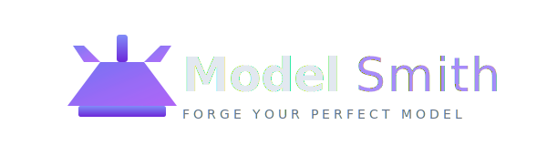
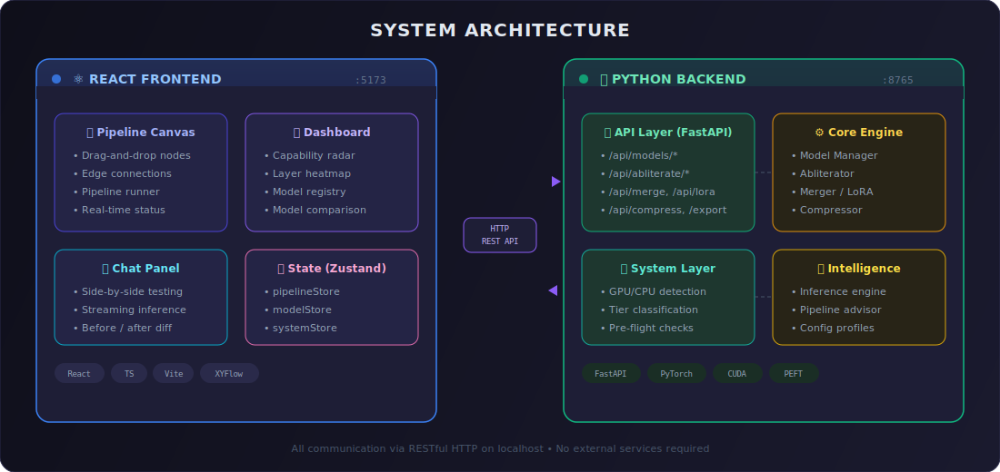
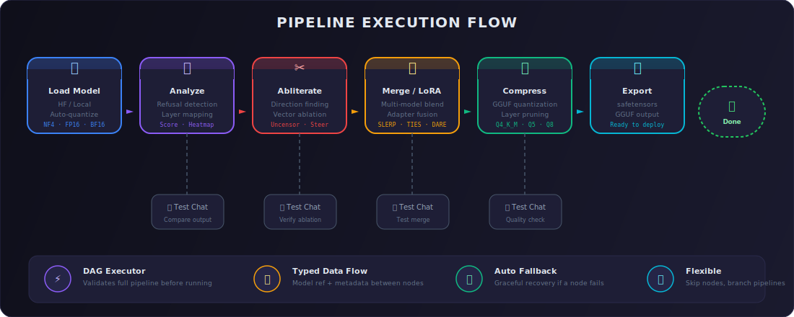

<div align="center">



**Forge Your Perfect Model**

[](https://python.org)
[](https://typescriptlang.org)
[](https://fastapi.tiangolo.com)
[](https://react.dev)
[](https://github.com/subhakantrout/modelsmith)
[](https://github.com/subhakantrout/modelsmith/blob/master/LICENSE)
[](https://github.com/subhakantrout/modelsmith/pulls)

**A visual node-based pipeline studio for local AI models — uncensor, merge, enhance, and compress without writing code.**

[Why ModelSmith](#-why-modelsmith) • [Features](#-features) • [Use Cases](#-use-cases) • [Quick Start](#-quick-start) • [Architecture](#-architecture) • [API](#-api-overview) • [Roadmap](#-roadmap)

</div>

---

## 🌟 Why ModelSmith?

Local AI is powerful, but it's trapped behind three walls:

| Wall | Problem | ModelSmith Solution |
|------|---------|-------------------|
| **🧱 Censorship** | Models refuse legitimate requests even after you download them | **One-click abliteration** — surgically removes refusal directions from any LLM |
| **🧩 Capability Gaps** | No single model excels at everything | **Visual merging & LoRA** — combine strengths of multiple models with drag-and-drop |
| **⚡ Hardware Mismatch** | Powerful models won't run on consumer hardware | **Smart compression** — auto-selects quantization level for your specific RAM/VRAM |

**ModelSmith replaces hours of command-line fiddling with a visual pipeline canvas.** No Python scripts, no terminal incantations — just connect nodes and run.

---

## 🔥 Features

### Core Pipeline

| Node | What It Does | Powered By |
|------|-------------|------------|
| **📥 Load Model** | Load any HuggingFace model with tier-appropriate quantization (NF4, FP16, BF16) | transformers + bitsandbytes |
| **🔬 Analyze** | Detect refusal patterns, score outputs, map layer-by-layer refusal direction | Custom refusal classifier |
| **✂️ Abliterate** | Remove censorship via directional ablation — find and subtract refusal vectors | Heretic/Abliterix technique |
| **🧩 Merge** | Combine models using advanced algorithms | mergekit (TIES, SLERP, DARE, Linear) |
| **🎛️ LoRA** | Inject or extract LoRA adapters to add/remove specific skills | PEFT |
| **📦 Compress** | Shrink models via GGUF quantization, layer pruning, KV cache compression, sparsification | llama.cpp + custom |
| **💬 Test Chat** | Side-by-side comparison of original vs edited model | Real inference |

### Intelligence Layer

- **🧠 Pipeline Advisor** — AI analyzes your hardware and recommends the optimal pipeline. Just describe your goal and ModelSmith builds the workflow.
- **📊 Smart Dashboard** — Live hardware monitoring, model registry browser, capability radar chart, layer refusal heatmap.
- **💾 Project System** — Save/restore pipelines as JSON projects, export/import recipes, resume from checkpoints.

### Hardware Awareness

ModelSmith **auto-detects** your system on launch and classifies into one of 5 tiers:

| Tier | RAM | VRAM | Can Handle |
|------|-----|------|------------|
| 🟢 Tier 1 | 4 GB | None | 3B models (CPU only) |
| 🔵 Tier 2 | 8 GB | ≤6 GB | 13B models (4-bit) |
| 🟡 Tier 3 | 16 GB | 8–12 GB | 34B models (4-bit) |
| 🟠 Tier 4 | 32 GB | 24 GB | 70B+ models (8-bit) |
| 🔴 Tier 5 | 64+ GB | 48+ GB | Any model (FP16) |

Every operation runs a **pre-flight check** against your available RAM. If it won't fit, ModelSmith suggests fallbacks (lower quantization, CPU offload, or streaming).

---

## 🎯 Use Cases

### "I want to use Llama 3.1 locally, but it refuses too many requests"

**Pipeline:** `[Load] → [Analyze] → [Abliterate] → [Export]`

ModelSmith loads your model, measures its refusal rate across 10+ test prompts, finds the exact refusal direction vector in the residual stream, and ablates it — all in a few clicks. Test the result immediately in the built-in chat panel.

### "I have a coding model and a creative writing model — I want both skills in one"

**Pipeline:** `[Load Base] → [Merge with Model B] → [Export]`

Use the Merge node with SLERP or TIES to interpolate model weights. The dashboard shows capability scores so you can tune the merge ratio visually.

### "This 70B model is amazing but won't fit in my 16 GB RAM"

**Pipeline:** `[Load] → [Compress] → [Export]`

Select GGUF quantization at Q4_K_M and see the estimated size drop from 35 GB to 12 GB — before you run anything. The pre-flight check confirms your system can handle it.

### "I need my model to follow instructions better"

**Pipeline:** `[Load] → [LoRA: Apply Adapter] → [Fuse] → [Export]`

Download a LoRA adapter from HuggingFace, point ModelSmith at it, and fuse it permanently into your model. No training required.

---

## 🚀 Quick Start

### Prerequisites

- Python 3.10+, Node.js 18+, npm 9+
- (Optional) NVIDIA GPU with CUDA 12+

```bash
# Clone
git clone https://github.com/subhakantrout/modelsmith.git
cd modelsmith

# Backend
python3 -m venv venv
source venv/bin/activate
pip install -r backend/requirements.txt

# Frontend
cd frontend && npm install && cd ..
```

### Run

| Terminal | Command |
|----------|---------|
| **Backend** | `uvicorn backend.main:app --port 8765 --reload` |
| **Frontend** | `cd frontend && npm run dev` |

Open **http://localhost:5173** 🎉

---

## 🏗 Architecture

<div align="center">

</div>

### Pipeline Execution Model

<div align="center">

</div>

> Each node is a typed Python function. Connections represent data flow (model reference + metadata). The DAG executor validates the entire pipeline before running, with automatic fallback if a node fails. You can **test at any stage** via the built-in Chat panel.

---

## 📊 Project in Numbers

| Metric | Value |
|--------|-------|
| **Backend tests** | 143 passing (100%) |
| **Frontend type coverage** | Strict TypeScript, zero errors |
| **API endpoints** | 40+ RESTful routes |
| **Pipeline nodes** | 7 types (Load, Analyze, Abliterate, Merge, LoRA, Compress, Export) |
| **Frontend components** | 25+ React components |
| **State stores** | 5 Zustand stores |

---

## 🧪 Testing

```bash
source venv/bin/activate
python -m pytest backend/tests/ -v          # All 143 tests
python -m pytest backend/tests/ --cov=backend --cov-report=term  # With coverage
```

---

## 🛣 Roadmap

### v0.2 — Near Term
- [ ] WebSocket streaming for inference and progress
- [ ] Tauri desktop wrapper (native app)
- [ ] More merge methods (dare_ties, task_arithmetic)
- [ ] Model Hub integration (browse community recipes)
- [ ] Dark/light theme toggle

### v1.0 — Stable Release
- [ ] Single `pip install modelsmith` command
- [ ] Native installers (.exe, .dmg, .AppImage)
- [ ] Vision model support (VLM abliteration)
- [ ] Plugin system for third-party nodes
- [ ] Inference server (OpenAI-compatible API)

### v2.0 — Advanced
- [ ] RLHF / DPO training nodes
- [ ] Multi-GPU support
- [ ] Batch processing (multiple models, same pipeline)
- [ ] Community Hub for sharing pipelines

---

## 🤝 Contributing

We welcome contributions! Whether it's bug fixes, new features, or documentation improvements:

1. **Fork** the repo
2. **Create** a feature branch (`git checkout -b feature/amazing`)
3. **Commit** your changes (`git commit -m 'feat: add amazing feature'`)
4. **Push** to the branch (`git push origin feature/amazing`)
5. **Open a Pull Request**

### Development Setup

```bash
# Install dev dependencies
pip install ruff pytest pytest-cov

# Run linting
ruff check backend/

# TypeScript check
cd frontend && npx tsc --noEmit

# Run tests
python -m pytest backend/tests/ -v
```

### Code Standards

- **Python:** PEP 8, type hints required
- **TypeScript:** Strict mode, avoid `any`
- **Commits:** Conventional commits (`feat:`, `fix:`, `docs:`, `chore:`)
- **Tests:** Required for all new modules

---

## 📚 Tech Stack

| Layer | Technologies |
|-------|-------------|
| **Frontend** | React 19, TypeScript 6.0, Vite 8, @xyflow/react, Tailwind CSS 4, Recharts, Zustand 5, Lucide |
| **Backend** | Python 3.13, FastAPI, Uvicorn, Pydantic v2 |
| **ML Engine** | transformers, PyTorch 2.5 (CUDA 12.4), bitsandbytes, accelerate |
| **Model Ops** | mergekit, PEFT, safetensors |
| **System** | psutil, nvidia-ml-py |
| **Quantization** | llama.cpp (GGUF), bitsandbytes (NF4/FP4) |

---

## 📖 API Overview

| Method | Endpoint | Purpose |
|--------|----------|---------|
| `GET` | `/api/health` | 🩺 Health check |
| `GET` | `/api/system/specs` | 💻 Hardware detection + tier |
| `GET` | `/api/system/resources` | 📊 Live RAM/CPU/GPU |
| `POST` | `/api/models/load` | 📥 Load any HF model |
| `GET` | `/api/models/loaded` | 📋 Current model status |
| `POST` | `/api/analyze/refusal` | 🔬 Refusal score for text |
| `POST` | `/api/abliterate/find-direction` | 🧭 Find refusal vector |
| `POST` | `/api/abliterate/apply` | ✂️ Apply ablation |
| `POST` | `/api/merge/run` | 🧩 Execute model merge |
| `POST` | `/api/lora/apply` | 🎛️ Apply LoRA adapter |
| `POST` | `/api/compress/quant-estimate` | 📦 Estimate compression |
| `POST` | `/api/export/run` | 💾 Export model |
| `GET` | `/api/advisor/recommend` | 🧠 Get pipeline recommendation |


---

## ⚠️ Known Limitations

| Limitation | Mitigation |
|------------|-----------|
| Abliteration may degrade quality on some architectures | Always test with the built-in Chat panel before/after |
| Merging models with different tokenizers can produce broken output | Use models from the same architecture family |
| Extreme compression (< Q3) causes quality loss | ModelSmith warns you and suggests the sweet spot |
| Vision models not yet supported | Planned for v1.0 |
| GGUF conversion requires llama.cpp binaries | Install separately or use safetensors export |

---

## 📄 License

This project is licensed under the **MIT License** — see the [LICENSE](LICENSE) file for details.

Copyright © 2026 **Subhakanta Rout**

---

<div align="center">

**⭐ Star this repo if you find it useful!**

[Report Bug](https://github.com/subhakantrout/modelsmith/issues) • [Request Feature](https://github.com/subhakantrout/modelsmith/issues) • [Read Docs](https://github.com/subhakantrout/modelsmith)

</div>
